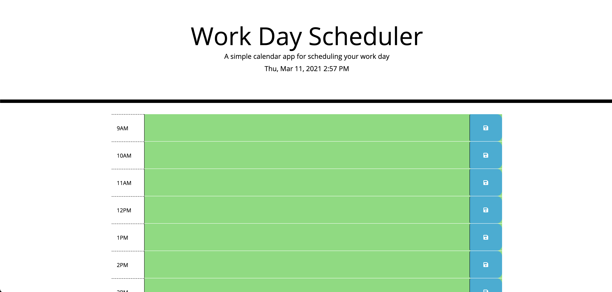
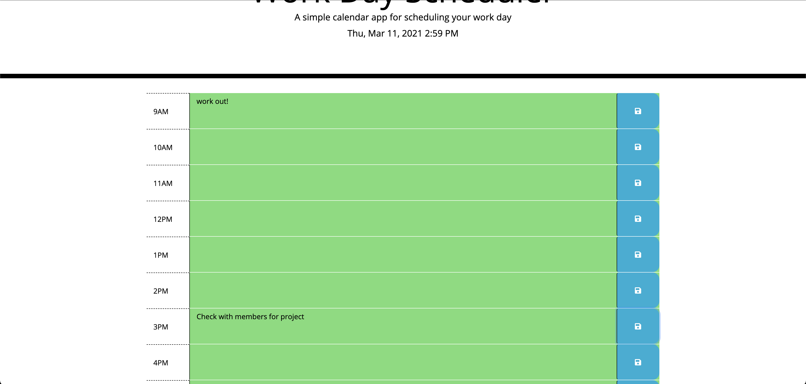

# work-day-scheduler

## Description
It is a planner in which you can write your notes or task. The icon will save the content in the textare and save it to local storage for persistance data. The time blocks will check with current time to check in task.. The are will change color depending on the time submited. we have past, present and future classes with specific color to know which is which. 

## Deployment links

https://github.com/cesarrr93/work-day-scheduler

https://cesarrr93.github.io/work-day-scheduler/